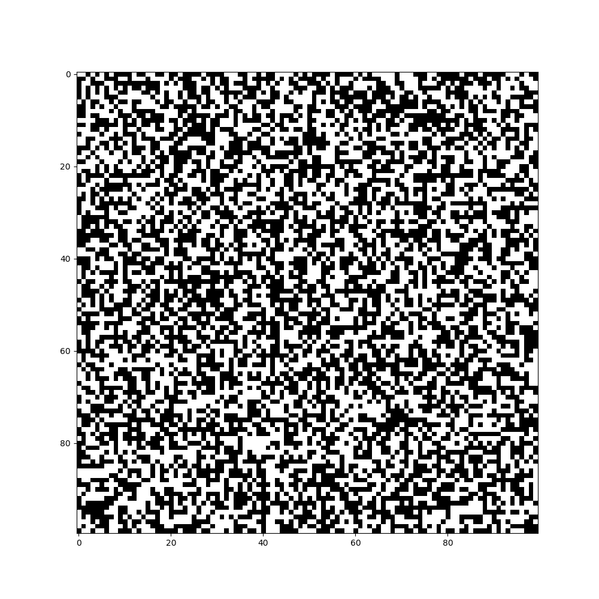

# Cellular Automata

We present you a new Python library , the **cellular_automata**.

## How to install

Clone the current repository and then,

```bash
> cd cellular_automata_library
> python3 setup.py install
```

That's it; you have already installed it.

## What can I do?

Let's start with a simple and famous example of cellular automata,
the [game of life](https://en.wikipedia.org/wiki/Conway%27s_Game_of_Life).
  So go to your favorite Python IDE or directly to the Python repl and copy the follow piece of code,

```python
from cellular_automata.cellular_automata import cellular_automata as ca
game_of_life = ca(width=100,height=100,generations=100)
game_of_life.game_of_life()
```

In the end, a GIF will pop up to your desktop, like this one:

 


## Preview all choices

First of all for now the library supports only binary cellular automata,
 with the following format options:
 * [Moore neighbohood](https://en.wikipedia.org/wiki/Moore_neighborhood),
 In this case the cell has 8 neighbors and the rule format is,
 Bxxx/Sxxx. The x can be numbers from 0 to 8.
 * [Von Neumann neighborhood
](https://en.wikipedia.org/wiki/Von_Neumann_neighborhood),
 In this case the cell has 4 neighbors and the rule format is,
 Bxxx/SxxxV. The x can be numbers from 0 to 4.
 * [Hexagonal neighborhood](https://en.wikibooks.org/wiki/Cellular_Automata/Neighborhood)
 In this case the cell has 6 neighbors and the rule format is,
  Bxxx/SxxxH. The x can be numbers from 0 to 6.


```python
ca(width=10,height=10, input_array='', generations=10, save_image=False,
                 save_data=False, filename='')
```
These are the pre-defined parameters in the library:

* width: takes an int number and defines the width of the board
* height: takes an int number and defines the height of the board
* input_array: takes a numpy array with only 0s and 1s. If we don't
define this parameter the library will create a random numpy array with zeros and ones
* generations: takes a int number and defines how many generations we will have
* save_image:If set to True, the library saves the output gif with the name which is define via the parameter filename
* save_file: If set to True, a file with the name passed to the parameter filename is created and it contains a list of numpy arrays
* filename: This is the name used to save the gif file and the list of the numpy array which represnt the generations

There is a list of cellular automata rules which are already implemented. To
use them first define the above parameters:

```python
from cellular_automata.cellular_automata import cellular_automata as ca
sample = ca(width=10,height=10, input_array='', generations=10, save_image=False,
                          save_data=False, filename='')
```

Then, depending the automaton you want to use:

1. Game of life
```python
sample.game_of_life()
```
2. Replicator
```python
sample.replicator()
```
3. Seeds
```python
sample.seeds()
```
4. Life without death
```python
sample.life_without_death()
```
5.Life
```python
sample.life()
```
6.Diamoeba
```python
sample.diamoeba()
```
7.2x2
```python
sample.rule_2x2()
```
8.HighLife
```python
sample.highlife()
```
9.Day & night
```python
sample.day_and_night()
```
10.Morley
```python
sample.morley()
```
11. Anneal
```python
sample.anneal()
```

But someone may want to implement their rules or a rule set we don't have implement yet. So? No problem.

```python
sample.specify_rule_2d(<rule>)
```
The only restriction is that the rule must be in this formation, Bxxx/Sxxx.  Where x is a number from 0 to 8.
For example if you to specify the Anneal rule, you can just do this,
```python
sample.specify_rule_2d('B4678/S35678')
```
There rest will be done by the library.


## TODO
- [ ] Add classic [examples of patterns](https://en.wikipedia.org/wiki/Conway%27s_Game_of_Life)
- [ ] Add Wolfram 256 rules
- [ ] Add library to pip
- [ ] Improve the speed of library
- [ ] Add more binary cellular automata
- [ ] Add binary stochastic cellular automata
- [ ] Add automata with more than 2 states
- [ ] Add more complecate automata-models like [Forest-fire model](https://en.wikipedia.org/wiki/Forest-fire_model)
- [ ] Make easier to users to make their models like that
